# Slicer Automated Dental Tools


The Slicer Automated Dental Tools extension provides automatic dental and craniofacial analysis capabilities. It features a user-friendly graphical interface on 3D Slicer, enabling users to perform complex tasks without any coding expertise.


<p align="center">
    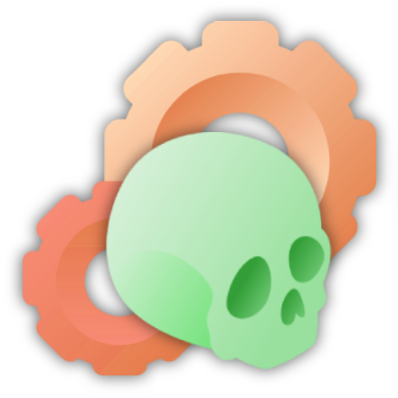
</p>

**Compatible with both stable and nightly versions of 3D Slicer.** 
Latest versions supported: **5.7.0 (nightly)** and **5.6.1 (stable)** 
## Overview

Slicer automated dental tools is an extension that allows users to perform automatic **segmentation**, **landmark identification** and **Automatic Orientation** on CBCT scans and Intra Oral Scan (IOS) using machine learning tools where the learning mdoels are continously updated.


<p align="center">
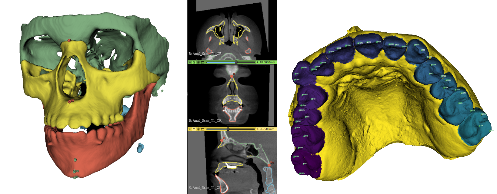
</p>

## Features


* **Simple**: Perform time consuming task with a few clicks.
* **Automatic**: Automate important Dental and Cranio Facial analysis tasks.
* **Flexible**: The user can choose which models to use to perform the automated task. New models can be added easily.


## Modules

| Name | Description |
|------|-------------|
| [AMASSS](#amasss-module) | Perform automatic segmentation of CBCT scan. AMASSS is an acronym for Automatic Multi-Anatomical Skull Structure Segmentation. |
| [ALI](#ali-module) | Perform automatic landmark identification on either CBCT or IOS scans. ALI is an acronym for Automatic Landmark Identification. |
| [ASO](#aso-module) | Perform automatic orientation either on IOS or CBCT files. |
| [AReg](#areg-module) | Perform automatic registration on IOS or CBCT files. |
| [AutoCrop3D](#autocrop3d-module) | Automatically crop a folder of CBCT scans with the same region of interest. |
| [AutoMatrix](#automatrix-module)| Automatically apply one or different matrix to a folder of IOS or CBCT scans. |
| [MRI2CBCT](#mri2cbct-module) | Contains the steps to perform the registration of MRI and CBCT scans.|
| [FlexReg](#flexreg-module) | Registration of IOS patient per patient with customizable patch creation. |
| [DOCShapeAXI](#docshapeaxi-module) | Automatic classification of 3D Shape. DOC-ShapeAXI is an acronym for Dental Oral and Craniofacial Shape Analysis eXplainability and Interpretability. |
| [BatchDentalSegmentator](#batchdentalseg) | DentalSegmentator in batch for mixed or permanent dentition |


These modules provide a convenient user interface, are available through the `Automated Dental Tools` module category, and share common features :

**Input**
- All modules can work with one file or a whole sample (folder) as input.
- If the input is a single file already loaded, the result of the predicton will directly show up on the slice views.

**Output**
- By selecting the "Group output in a folder" checkbox, all the ouput files will be grouped in a single folder for each patient.
- All modules allows the user to save the output in the input folder, or by unchecking the "Save prediction in scan folder" the user can choose a custom output folder.
- The "Prediction ID" field is for the user to choose what will appear on the output file name. ("Pred" by default)


Additionally, the following modules are implemented as python scripted command-line (CLI) modules available in the `Automated Dental Tools.Advanced`  module category and are used internally by the modules described above.

| Name | Description |
|------|-------------|
| [AMASSS_CLI](AMASSS_CLI) | Perform automatic segmentation of CBCT scans |
| [ALI-CBCT](ALI_CBCT) | Perform automatic landmark identification of CBCT scans|
| [ALI-IOS](ALI_IOS) | Perform automatic landmark identification of IOS scans|
| [ASO-CBCT](ASO_CBCT) | Perform automatic orientation of CBCT scans |
| [ASO-IOS](ASO_IOS) | Perform automatic orientation of IOS scans |
| [AReg-CBCT](AREG_CBCT) | Perform automatic registration of CBCT scans |
| [AReg-IOS](AREG_IOS) | Perform automatic registration of IOS scans |
| [MRI2CBCT_ORIENT_CENTER_MRI](MRI2CBCT_ORIENT_CENTER_MR) | Perform orientation and centering of MRI scans |
| [MRI2CBCT_RESAMPLE_CBCT_MRI](MRI2CBCT_RESAMPLE_CBCT_MRI) | Perform resample of MRI and CBCT scans |
| [MRI2CBCT_REG](MRI2CBCT_REG) | Perform registration of MRI-CBCT scans |
| [FlexReg_CLI](FlexReg_CLI) | Perform creation of patch and registration on IOS scans. |
| [DOCShapeAXI](DOCShapeAXI_CLI) | Perform automatic classification of 3D Shape. |
| [BatchDentalSegmentator](BatchDentalSegmentator) | DentalSegmentator in batch for mixed or permanent dentition |


## Requirements

* In addition of the [Slicer System requirements](https://slicer.readthedocs.io/en/latest/user_guide/getting_started.html#system-requirements), for best performance, 12GB of memory is recommended.
* :warning: Trained networks are required to be manually downloaded. See requirements section specific to each module.


---

## AMASSS Module


AMASSS module will allow you to segment CBCT scan using [AMASSS](https://github.com/Maxlo24/AMASSS_CBCT) algortihm.

### Prerequisites

* Download the [trained models for AMASSS](https://github.com/Maxlo24/AMASSS_CBCT/releases/download/v1.0.1/ALL_NEW_MODELS.zip) using the `Download latest models` button in the module `Input section`.

### Module structure

**Input file:**
The input has to be an oriented CBCT.
It can be a single CBCT scan loaded on slicer or a folder containg CBCTs with the following extention:
```
.nrrd / .nrrd.gz
.nii  / .nii.gz
.gipl / .gipl.gz
```

Available sample data for testing: [MG_test_scan.nii.gz](https://github.com/Maxlo24/AMASSS_CBCT/releases/download/v1.0.1/MG_test_scan.nii.gz)

**Load models:**
The user has to indicate the path of the folder containing the [trained models for AMASSS](https://github.com/lucanchling/AMASSS_CBCT/releases/tag/v1.0.2).

**Segmentation selection:**
The user can choose the structure to segment using the selection table.
Depending on the type of CBCT to segment, the user can select the "Use small FOV models" checkbox to use on higher definition scans.


**Output option:**
By selecting the **"Generate surface files"** checkbox. The user will also get a **surface model of the segmentation** that will be saved in a "VTK files" folder and will be automatically loaded in slicer at the end of the prediction if **working on a single file**.

**Advanced option:**
- You can increase/decrease the precision of the segmentation (going above 50 will drastically increase the prediction time and is not necesary worth it, going under 50 will make the prediction much faster but less accurate)
- If the user whant to generate surface files, he can choose the smothness applied on the model.
- Depending on your computer power, you can increase the CPU and GPU usage to increase the predictio speed.


---

## ALI Module
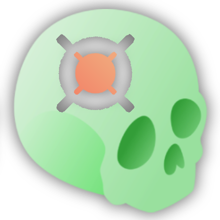

ALI module provide a convenient user interface allowing to identify landmarks on different type of scans:
- [CBCT](#ali-cbct) scan
- [IOS](#ali-ios) scan


### ALI-CBCT

The implementation is based on the `ALI-CBCT` algortihm originally developed by Maxime Gillot at https://github.com/Maxlo24/ALI_CBCT.

### Prerequisites

* Download the [trained models for ALI-CBCT](https://github.com/DCBIA-OrthoLab/SlicerAutomatedDentalTools/releases/tag/v0.1-v2.0_models) using the `Download latest models` button in the module `Input section`.

### Module structure

**Input file:**
The input has to be an oriented CBCT.
It can be a single CBCT scan loaded on slicer or a folder containg CBCTs with the following extention:
```
.nrrd / .nrrd.gz
.nii  / .nii.gz
.gipl / .gipl.gz
```
Available sample data for testing: [MG_test_scan.nii.gz](https://github.com/Maxlo24/AMASSS_CBCT/releases/download/v1.0.1/MG_test_scan.nii.gz)

**Load models:**
The user has to indicate the path of the folder containing the [trained models for ALI-CBCT](https://github.com/Maxlo24/ALI_CBCT/releases/tag/v0.1-models).


**Landmark selection:**
Once the folder containing the trained models is loaded. The user can choose the landmark he want to identify with the table showing the available landmarks:


---

### ALI-IOS

The implementation is based on the `ALI-IOS` algortihm originally developed by Baptiste Baquero at https://github.com/baptistebaquero/ALIDDM.

### Prerequisites

* Download the [trained models for ALI-IOS](https://github.com/baptistebaquero/ALIDDM/releases/tag/v1.0.3) using the `Download latest models` button in the module `Input section`.

### Module structure

**Input file:**
The input has to be an oriented IOS segmented with the [Universal Numbering System](https://en.wikipedia.org/wiki/Universal_Numbering_System).
This segmentation can be automatically done using the [SlicerJawSegmentation](https://github.com/MathieuLeclercq/SlicerJawSegmentation) extention.
The input can be a single IOS loaded on slicer or a folder containg IOS with the following extention:
The array name of labels in the vtk surface is: "Universal_ID" or "predictionid" or "PredictionID"
```
.vtk
```

Available sample data for testing: [T1_01_L_segmented.vtk](https://github.com/baptistebaquero/ALIDDM/releases/tag/v1.0.4) and [T1_01_U_segmented.vtk](https://github.com/baptistebaquero/ALIDDM/releases/tag/v1.0.4)

**Load models:**
The user has to indicate the path of the folder containing the [trained models for ALI-IOS](https://github.com/baptistebaquero/ALIDDM/releases/tag/v1.0.3).


**Landmark selection:**
For the IOS landmarks, the user has to choose which tooth he need the landmakrs on by checking the label of the tooth on the left table.
Once the folder containing the trained models is loaded. The user can choose the landmark he want to identify with the table on the right showing the available landmarks:


## ASO Module
If you want more information and a descriptive tutorial of this tool, take a look at this github page: **[Automated Standardized Orientation](https://github.com/lucanchling/ASO#readme)**

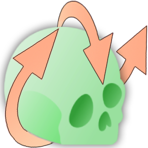

ASO module provide a convenient user interface allowing to orient different type of scans:
- **CBCT** scan
- **IOS** scan

## How the module works?

### 2 Modes Available (Semi or Fully Automated)
- **Semi-Automated** (to only run the landmark-based registration with landmark and scans as input)
- **Fully-Automated** (to perform Pre Orientation steps, landmark Identification and ASO with only scans as input)

| Mode | Input |
| ----------- | ----------- |
| Semi-Automated | Scans, Landmark files |
| Fully-Automated | Scans, ALI Models, Pre ASO Models (for **CBCT** files), Segmentation Models (for **IOS** files) |


### Input file:

| Input Type  | Input Extension Type |
| ----------- | ----------- |
| **CBCT** | .nii, .nii.gz, .gipl.gz, .nrrd, .nrrd.gz  |
| **IOS** | .vtk .stl .vtp .off .obj |

**<ins>Test Files Available:**
You can either download them using the link or  by using the `Test Files` button.
| Module Selected  | Download Link to Test Files | Information |
| ----------- | ----------- | ----------- |
| **Semi-CBCT** | [Test Files](https://github.com/lucanchling/ASO_CBCT/releases/download/TestFiles/SemiAuto.zip) | Scan and Fiducial List for this [Reference](https://github.com/lucanchling/ASO_CBCT/releases/download/v01_goldmodels/Occlusal_Midsagittal_Plane.zip)|
| **Fully-CBCT** | [Test File](https://github.com/lucanchling/ASO_CBCT/releases/download/TestFiles/FullyAuto.zip) | Only Scan|
| **Semi-IOS** | [Test Files](https://github.com/HUTIN1/ASO/releases/download/v1.0.2/input_test.zip) | Mesh and Fiducial List [Reference](https://github.com/HUTIN1/ASO/releases/download/v1.0.0/Gold_file.zip) |
| **Fully-IOS** | [Test Files](https://github.com/HUTIN1/ASO/releases/download/v1.0.2/input_test.zip)| Only Mesh [Reference](https://github.com/HUTIN1/ASO/releases/download/v1.0.0/Gold_file.zip) |

### Reference:

The user has to choose a folder containing a **Reference Gold File** with an oriented scan with landmarks.
You can either use your own files or download ours using the `Download Reference` button in the module `Input section`.
| Input Type  | Reference Gold Files |
| ----------- | ----------- |
| **CBCT** | [CBCT Reference Files](https://github.com/lucanchling/ASO_CBCT/releases/tag/v01_goldmodels)  |
| **IOS** | [IOS Reference Files](https://github.com/HUTIN1/ASO/releases/tag/v1.0.1) |

### Landmark selection

The user has to decide which **landmarks** he will use to run ASO.

| Input Type  | Landmarks Available |
| ----------- | ----------- |
| **CBCT** |  Cranial Base, Lower Bones, Upper Bones, Lower and Upper Teeth |
| **IOS** |  Upper and Lower Jaw |

> The landmark selection is handled in the `Landmark Reference` Section:


### Models Selection

For the **Fully-Automated** Mode, models are required as input, use the `Select` Button to automatically download, extract and select the selected models.


## AReg Module

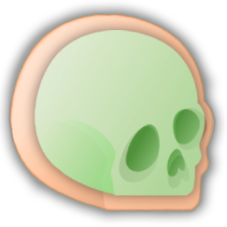

AReg module provide a convenient user interface allowing to orient different type of scans:
- **CBCT** scan
- **IOS** scan

## How the module works?

### 3 Modes Available
- **Semi-Automated** (to only run the automatic registration with masks segmentation and scans as input - ***only for CBCT***)
- **Fully-Automated** (to perform the automatic registration with only scans as input)
- **Orientation and Registration** (to perform the automatic orientation using [ASO](#aso-module) process and the automatic registration with only scans as input)

| Mode | Input |
| ----------- | ----------- |
| Semi-Automated (only for **CBCT**) | Scans, Masks segmentation |
| Fully-Automated | Scans, Segmentation Models |
| Orientation and Registration | Scans, ALI Models (for **CBCT** files), Segmentation Models  |
> For CBCT, a final step is added and consist of segmenting different skeletal structures using AMASSS process within each mode.

### Input file:

| Input Type  | Input Extension Type |
| ----------- | ----------- |
| **CBCT** | .nii, .nii.gz, .gipl.gz, .nrrd, .nrrd.gz  |
| **IOS** | .vtk .stl .vtp .off .obj |

**<ins>Test Files Available:**
You can either download them using the link or  by using the `Test Files` button.
| Module Selected  | Download Link to Test Files | Information |
| ----------- | ----------- | ----------- |
| **Semi-CBCT** | [Test Files](https://github.com/lucanchling/Areg_CBCT/releases/download/TestFiles/SemiAuto.zip) | Scan and Masks segmentation|
| **Fully-CBCT** | [Test File](https://github.com/lucanchling/Areg_CBCT/releases/download/TestFiles/FullyAuto.zip) | Only Oriented Scan|
| **Orientation and Registration for CBCT** | [Test File](https://github.com/lucanchling/Areg_CBCT/releases/download/TestFiles/Or_FullyAuto.zip) | Only Scan|
| **Fully-IOS** | [Test Files](https://github.com/HUTIN1/AREG/releases/download/v1.0.0/AREG_test_scans.zip)| Only Mesh ) |
| **Orientation and Registration for IOS** | [Test Files](https://github.com/HUTIN1/AREG/releases/download/v1.0.0/AREG_test_scans.zip) | Only Mesh |

### Pipelines

#### CBCT - AReg Pipeline


#### IOS - Patch prediction


### Some Results


### Models Selection

For the **Fully-Automated** Mode, models are required as input, use the `Select` Button to automatically download, extract and select the selected models.

## AutoCrop3D Module

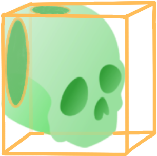

AutoCrop3D stands for "Scans automatically cropped" according to a Region Of Interest (ROI).

## Useful Information

This module has the same utility as "Crop Volume", which offers more interactive feedbacks to the user, but "AutoCrop3D" allows you to easily trim the ROI of all the cases in your study.
Then you can load your files into Slicer to view them. [More Information about Crop Volume](https://slicer.readthedocs.io/en/latest/user_guide/modules/cropvolume.html)

It solves the issue of files that may be too heavy for "Crop Volume Sequence" [More Information about Crop volume Sequence](https://slicer.readthedocs.io/en/latest/user_guide/modules/cropvolumesequence.html).


## How does the module work?

### Input:

|Input | Input Type  | Input Extension Type | Files to Test
| ----------- | ----------- | ----------- | ----------- |
|**File or Folder**| **CBCT** | .nii, .nii.gz, .gipl.gz, .nrrd, .nrrd.gz  |[Segmentation.zip](https://github.com/DCBIA-OrthoLab/SlicerAutomatedDentalTools/files/12401589/Segmentation.zip) |
|**Region of Interest***| **Volume** | .json |[ROI.mrk.zip](https://github.com/DCBIA-OrthoLab/SlicerAutomatedDentalTools/files/12401594/Crop_Volume_ROI_R_Centered.mrk.zip) |


You can choose a suffix which will be added to the existing name of your file(s).

If you want to **generate VTK files** from your Segmentations, the Segmentation files must have "Seg" somewhere in the name.
For example: `patientName_Seg.nii.gz`

### How to create a Region Of Interest?

Use the module "Volume Rendering" to create your ROI and then save it as a .json file.
1. Upload a scan file
2. Choose the option `Display ROI`
3. Change the ROI as you like
4. Save it


## AutoMatrix Module

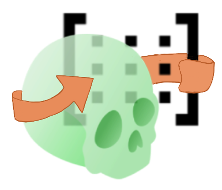

The AutoMatrix module provides a user interface to apply a matrix to a folder for different types of scans or segmentations:
- **CBCT**
- **IOS**
## How the module works?

### How to name the new files and where they are stored
The module will replicate the folder structure from your input folder inside the output folder.
Each new file will keep the original filename, followed by the suffix you specify.
If the "Add matrix name to filename" option is enabled, the matrix filename will also be appended.

Example:  
| With matrix name | Without matrix name |
| ----------- | ----------- |
| **Input file:** patient1_T1_MA.nii.gz | **Input file:** patient1_T1_MA.nii.gz
| **Input matrix:** patient1_matrix1.tfm | **Input matrix:** Matrix_mirror.tfm
| **Suffix:** _apply | **Suffix:** _mir
| **Output file:** patient1_T1_MA_apply_matrix1.nii.gz | **Output file:** patient1_T1_MA_mir.nii.gz


### 4 Modes available
Sometimes a LinkName is required. See the information below.
| Mode | Download Link to Test Files | Information |
| ----------- | ----------- | ----------- |
| File patient and file matrix| [Test Files](https://github.com/GaelleLeroux/DCBIA_Apply_matrix/releases/download/AutoMatrixTag/AutoMatrixRelease1.zip) |  LinkName is not required. The matrix is applied to the input file. This new file is save in the output folder.
| File patient and folder matrix | [Test Files](https://github.com/GaelleLeroux/DCBIA_Apply_matrix/releases/download/AutoMatrixTag/AutoMatrixRelease2.zip) | LinkName required. For each matrix applied, a new file is created.
| Folder patient and file matrix | [Test Files](https://github.com/GaelleLeroux/DCBIA_Apply_matrix/releases/download/AutoMatrixTag/AutoMatrixRelease3.zip) | LinkName is not required.  The matrix will be applied to all files in the input folder.
| Folder patient and folder matrix| [Test Files](https://github.com/GaelleLeroux/DCBIA_Apply_matrix/releases/download/AutoMatrixTag/AutoMatrixRelease4.zip) | LinkName required. For each matrix applied, a new file is created. You can have more than one file with the same patient name.

#### When a LinkName is required :
The name of the matrix files and the name of the seg/scan files must begin with the same patient name. After the patient name, you must put and underscore before any other information.
Example :
Name file patient : patient1_T1_MA.nii.gz
Name matrix files : patient1_left_MA.tfm

#### Mirror :
There is button "Mirror" that will automatically download the matrix mirror and put in input.

### Input file:

| Input Type  | Input Extension Type | Input Matrix Extension |
| ----------- | ----------- | ----------- |
| **CBCT** | .nii.gz | .tfm .npy .h5 .mat .txt |
| **IOS** | .vtk .stl .vtp .off .obj | .tfm .npy .h5 .mat .txt|
| **Landmark** | .mrk.json | .tfm .npy .h5 .mat .txt|

## MRI2CBCT Module


The MRI2CBCT module provides a user interface to perform the registration between MRI and CBCT scans.

### How does the module work?

#### Preprocessing Step:

1. **Orient and Center CBCT:**
   - **Input:** CBCT folder path
   - **Download Models:** You can download the models required for segmentation and orientation by clicking on "Download."

2. **Orient and Center MRI:**
   - **Bilateral mode:** When enabled, additional options become available:  
   This option is intended for bilateral TMJ scans, which contains two slices between left and right separated by a large distance.When such DICOM volumes are saved as NIfTI, the original slice spacing is lost or misrepresented, which distorts the image.  
   <br>
   Enabling bilateral mode lets you select a loaded DICOM node to automatically retrieve the true acquisition spacing (from DICOM metadata) and apply it before orientation. This ensures that the image is correctly resampled and anatomically accurate.
   > If **Bilateral** is disabled, the spacing from the input scan is used as-is.  
   - **Input:** MRI folder path
   - **Axis Direction:** You need to choose the new direction for each axis.

3. **Left and Right Cropping:**
   - **Inputs:** Folder paths for CBCT and/or MRI.

#### Resampling Step:
   - **Options:** You can resample T1 and/or T2 scans for **MRI**, **CBCT**, and **Segmentation** independently.
   - **Slice/Number of Slices:** Decide the new slices/number of slices or retain the same size as before running it.
   - **Spacing:** Choose the new spacing or keep the same spacing as in the input.
   - **Center Image:** When enabled, padding is added equally in all directions to center the content.

#### Approximation:
This step aligns the MRI and CBCT volumes to prepare for precise registration.
- **Inputs:** Resampled MRI and CBCT volumes.

#### Cropping (TMJ Region):
Currently, cropping is done using the AutoCrop method. In the future, this step will be replaced by a trained model that automatically identifies and extracts the TMJ region of interest.

#### Registration:
- **Inputs:** CBCT, CBCT segmentation, and MRI scans after completing the preprocessing steps, including manual approximation and cropping.
- **Normalization Options:** Select the normalization method and specify the percentile to apply to both MRI and CBCT scans. Default values are provided for convenience.
  
## FlexReg Module

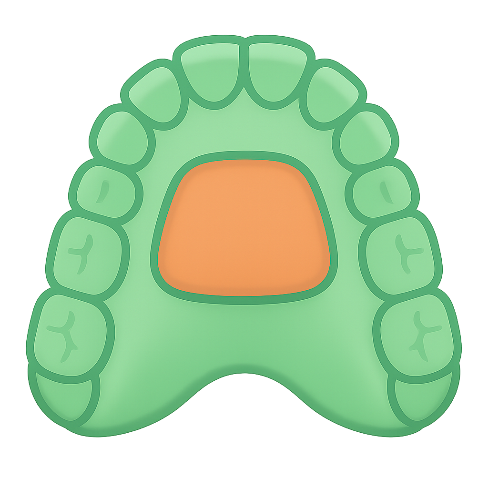

FlexReg is a module that allows you to register patient-specific Intra Oral Scans. It lets you create custom patches for registration.

### How does the module work?

1. **Load your files:**
   - Choose your path by clicking on "Select" and load it by clicking on "View".

2. **Draw your own patch:**
   - **Butterfly Patch:**
     - You can draw a butterfly patch using the parameters and select your own teeth. Note that this patch, with the default values, is called “ButterflyPatch” and is created when you run AREG_IOS:
       <p align="center">
         
       </p>
   - **Custom Patch:**
     - You can draw the patch using landmarks and customize it:
     - <p align="center">
         
       </p>
   - You can combine multiple patches by creating them one by one. All your patches will be used as a single patch for the registration.
   - <p align="center">
         
       </p>

3. **Registration:**
   - After creating your patch for both the fixed and moving scans, choose the output folder and the suffix you would like. If you have a lower arch to move, you can select it.
   - Register them by clicking on "Registration".


## DOCShapeAXI Module


This integrates advanced deep learning algorithms enabling the classification of nasopharynx airways obstruction, mandibular condyles, and alveolar bone defect in cleft. The tool facilitates the automated classification of medical shapes, assisting in clinical diagnosis and decision-making.
The extension was originally developped https://github.com/lucieDLE/DOC-ShapeAXI/

### Prerequisites

* This extension works with Linux and Windows.
* This extension requires the installation of SlicerConda. Follows the [instructions](https://github.com/DCBIA-OrthoLab/SlicerConda) for more information.


### Supported Dataset
Currently, the extension supports only three types of datasets:
- Nasopharynx Airway Obstruction: Three models are available for this dataset. 
  - **Severity model**: classifies 4 levels of airway obstruction ranging from 0 to 3, where 0 is the lowest level and 3 is the greatest level. 
  - **Binary model**: classifies between 0 and 1, where 0 is the absence and 1 is the presence of adenoid hypertrophy-related obstruction. 
  - **Regression model**: directly predicts the ratio of obstruction ranging between 0 and 100%.
- Mandibular Condyle: 
  - **Severity model**: classifies the condylar changes into 4 levels of severity ranging from 0 to 3.
- Alveolar Bone Defect in Cleft: 
  - **Severity model**: classifies the defect into 4 levels of severity ranging from 0 to 3.

### How does the module work?

 1. Select a **Data Type**: nasopharynx airways obstruction, mandibular condyles, and alveolar bone defect in cleft.
   > [!NOTE]
   > This step allow to select automatically the appropriate classification model.
 2. Select an **Input folder**: a folder that contains 3D models stored as VTK files.
 3. Select an **Output directory**: a folder that will contain all the outputs (model, predictions results stored in a CSV file, and explainability visualizations).
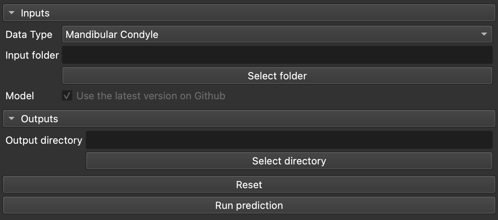
 4. Run the module: Click on the **Run Prediction** button. 
   > [!NOTE]
   > The progress will be display in the UI with a progress bar.

### Viewing the Results

All the results are saved in the **Output directory** specified by the user. you can find:

A. the csv file containing the prediction made by the network.

B. a folder named **Explainability** containing the visualization results:
  1. Open the folder and drag and drop a shape in Slicer
  2. Go to the module **Models**
      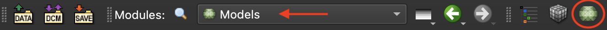
  3. In the **Display** drop-down menu, click on the **Scalar** section
  4. check the **visibility** box and change the color table to **ColdToHotRainbow**
  5. Set the **Data Scalar Range** to **Auto** if not set
    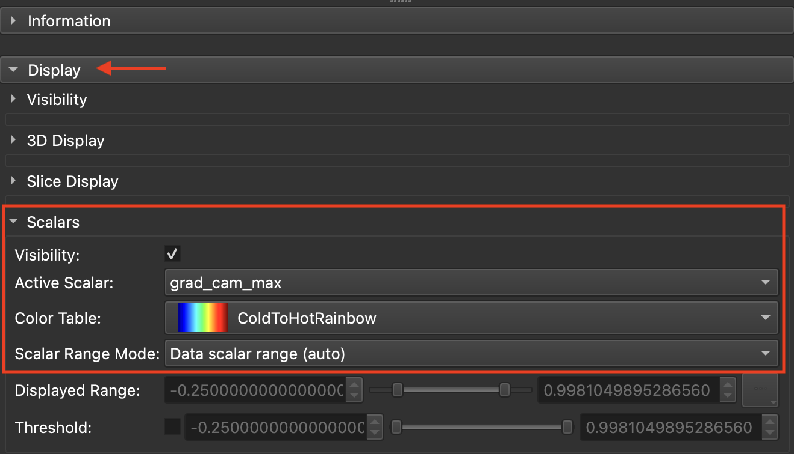
  6. Change the **Active Scalar** to the class you want to visualize


## BatchDentalSeg
3D Slicer extension for fully-automatic segmentation of CT and CBCT dental volumes in batch using Dentalsegmentator model (for adults scans), PediatricDentalsegmentator model (for children scans), UniversalLabDentalSegmentator (for labeling all the teeth), NasoMaxillaDentalSegmentator (for segment separatly the upper skull and the Naso Maxillary Complex.


After selecting the following:

1. **Input folder** (containing volumes to process)  
2. **Output folder** (where segmentations will be saved)  
3. **Model** (the pretrained network that best fits your scans)  

this module generates the following labeled regions for each volume:

### PediatricDentalSegmentator  
*(Identical to DentalSegmentator)*  
- **Maxilla & Upper Skull**  
- **Mandible**  
- **Upper Teeth**  
- **Lower Teeth**  
- **Mandibular canal**  

### DentalSegmentator  
- **Maxilla & Upper Skull**  
- **Mandible**  
- **Upper Teeth**  
- **Lower Teeth**  
- **Mandibular canal**  

### NasoMaxillaDentalSegmentator  
This model splits the upper skull into two regions and also segments teeth and mandible:  
- **Upper Skull** (excluding nasal/maxillary complex)  
- **Naso-Maxilla Complex**  
- **Mandible**  
- **Upper Teeth**  
- **Lower Teeth**  
- **Mandibular canal**  

### UniversalLabeling  
Same as DentalSegmentator, but each tooth receives its own unique label:  
- **Maxilla & Upper Skull**  
- **Mandible**  
- **Upper Teeth** (each tooth labeled separately)  
- **Lower Teeth** (each tooth labeled separately)  
- **Mandibular canal**  

### DentalSegmentator model

DentalSegmentator is based on nnU-Net framework. It has been trained on 470 dento-maxillo-facial CT and CBCT scans from 7 institutions by Dot G, et al, here is their paper and nnUnet paper:

>Dot G, et al. DentalSegmentator: robust open source deep learning-based CT and CBCT image segmentation. Journal of Dentistry (2024) doi:[10.1016/j.jdent.2024.105130](https://doi.org/10.1016/j.jdent.2024.105130)

>Isensee F, et al. nnU-Net: a self-configuring method for deep learning-based biomedical image segmentation. Nat Methods. 2021;18(2):203-211. doi:[10.1038/s41592-020-01008-z](https://doi.org/10.1038/s41592-020-01008-z)

### PediatricDentalSegmentator model

As DentalSegmentator, PediatricDentalSegmentator is also based on nnUnet. It has been trained on 513 dento-maxillo-facial CBCT scans including scans withs primary teeth.

### UniversalLabDentalSegmentator model

As PediatricDentalSegmentator, UniversalLabDentalSegmentator is also based on nnUnet. It has been trained on 513 dento-maxillo-facial CBCT scans including scans withs primary teeth

### NasoMaxillayDentalSegmentator model

As DentalSegmentator, NasoMaxillaryDentalSegmentator is also based on nnUnet. It has been trained on 135 dento-maxillo-facial CBCT scans including scans withs primary teeth.

### Using the extension

This extension is compatible with 3D Slicer Stable Release (version 5.8.0, or later), downloadable [from the official website]( https://download.slicer.org/ ). 

The plugin can be installed in Slicer using
the [extension manager]( https://slicer.readthedocs.io/en/latest/user_guide/extensions_manager.html#install-extensions).
It's a module in the Automated Dental Tools extension so it can be can be found using the search bar by typing "Automated Dental Tools".

After the installation process and restart of Slicer, the extension can be found in the module file explorer under `Automated Dental Tools>BatchDentalSegmentator`.
It can also be found by using the `find` module button and searching for the keyword `BatchDentalSegmentator`.

You will also need to install the `NNUNet` extension, you can find it by using the `find` module button and searching for the keyword `NNUNet`

To use the extension, click on `Select Folder` to select the folder where your scans are and  click on `Select Output Folder` to select the folder where your segmentations will be save.


Then choose the model that you want to use :


Finally click on the `Apply` button to start the segmentations.


If your device doesn't include CUDA, the processing may be very long and a dialog will ask for confirmation before
starting the segmentation process.

During execution, the processing can be canceled using the `Stop` button.
The progress will be reported in the console logs.


After the segmentation process has run, the segmentation will be loaded into the application.
The segmentation results can be modified using the `Segment Editor` tools.


The segmentation can be exported using the `Export segmentation` menu and selecting the export format to use.

The `Surface smoothing` slider allows to change the 3D view surface smoothing algorithm.

### Exemple of using 


# Acknowledgements

Authors: Maxime Gillot (University of Michigan), Baptiste Baquero (UoM), Luc Anchling (UoM), Nathan Hutin (UoM),Jeanne Claret (UoM),Gaelle Leroux (UoM), Enzo Tulissi (UoM), Alban Gaydamour (UoM),Gauthier Dot(AP-HP),Laurent GAJNY (ENSAM), Roman FENIOUX (KITWARE SAS), Thibault PELLETIER (KITWARE SAS), Lucia Cevidanes (UoM), Juan Carlos Prieto (UNC), David Allemang (Kitware), Jean-Christophe Fillion-Robin (Kitware), Connor Bowley (Kitware), James Butler (Kitware).

Supported by NIDCR R01DE 024450, AA0F Grabber Family Teaching and Research Award and by Research Enhancement Award Activity 141 from the University of the Pacific, Arthur A. Dugoni School of Dentistry.


# License

This software is licensed under the terms of the [Apache Licence Version 2.0](LICENSE).
