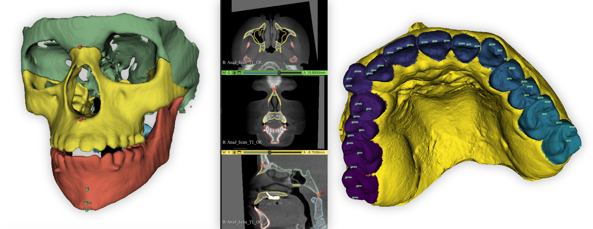

# Slicer Automated Dental Tools 


Slicer automated dental tools is an extension for 3D Slicer to perform important automatic Dental and Cranio Facial analysis tasks via a GUI interface with no coding knowledge needed.


<p align="center">
    
</p>

## Overview

Slicer automated dental tools is an extension that allows users to perform automatic **segmentation**, **landmark identification** and **Automatic Orientation** on CBCT scans and Intra Oral Scan (IOS) using machine learning tools where the learning mdoels are continously updated.


<p align="center">

</p>

## Features


* **Simple**: Perform time consuming task with a few clicks.
* **Automatic**: Automate important Dental and Cranio Facial analysis tasks.
* **Flexible**: The user can choose which models to use to perform the automated task. New models can be added easily.


## Modules

| Name | Description |
|------|-------------|
| [AMASSS](#amasss-module) | Perform automatic segmentation of CBCT scan. AMASSS is an acronym for Automatic Multi-Anatomical Skull Structure Segmentation. |
| [ALI](#ali-module) | Perform automatic landmark identification on either CBCT or IOS scans. ALI is an acronym for Automatic Landmark Identification. |
| [ASO](#aso-module) | Perform automatic orientation either on IOS or CBCT files. |

These modules provide a convenient user interface, are available through the `Automated Dental Tools` module category, and share common features :

**Input**
- All modules can work with one file or a whole sample (folder) as input.
- If the input is a single file already loaded, the result of the predicton will directly show up on the slice views.

**Output**
- By selecting the "Group output in a folder" checkbox, all the ouput files will be grouped in a single folder for each patient.
- All modules allows the user to save the output in the input folder, or by unchecking the "Save prediction in scan folder" the user can choose a custom output folder.
- The "Prediction ID" field is for the user to choose what will appear on the output file name. ("Pred" by default)


Additionally, the following modules are implemented as python scripted command-line (CLI) modules available in the `Automated Dental Tools.Advanced`  module category and are used internally by the modules described above.

| Name | Description |
|------|-------------|
| [AMASSS_CLI](AMASSS_CLI) | Perform automatic segmentation of CBCT scan. |
| [ALI-CBCT](ALI_CBCT) | Perform automatic landmark identification in CBCT |
| [ALI-IOS](ALI_IOS) | Perform automatic landmark identification in IOS |
| [ASO-CBCT](ASO_CBCT) | Perform automatic orientation either on CBCT |
| [ASO-IOS](ASO_IOS) | Perform automatic orientation either on IOS |


## Requirements 

* In addition of the [Slicer System requirements](https://slicer.readthedocs.io/en/latest/user_guide/getting_started.html#system-requirements), for best performance, 12GB of memory is recommended.
* :warning: Trained networks are required to be manually downloaded. See requirements section specific to each module.


---

## AMASSS Module


AMASSS module will allow you to segment CBCT scan using [AMASSS](https://github.com/Maxlo24/AMASSS_CBCT) algortihm.

### Prerequisites

* Download the [trained models for AMASSS](https://github.com/Maxlo24/AMASSS_CBCT/releases/download/v1.0.1/ALL_NEW_MODELS.zip) using the `Download latest models` button in the module `Input section`.

### Module structure

**Input file:**
The input has to be an oriented CBCT.
It can be a single CBCT scan loaded on slicer or a folder containg CBCTs with the following extention:
```
.nrrd / .nrrd.gz
.nii  / .nii.gz
.gipl / .gipl.gz
```

Available sample data for testing: [MG_test_scan.nii.gz](https://github.com/Maxlo24/AMASSS_CBCT/releases/download/v1.0.1/MG_test_scan.nii.gz)

**Load models:**
The user has to indicate the path of the folder containing the [trained models for AMASSS](https://github.com/Maxlo24/AMASSS_CBCT/releases/download/v1.0.1/ALL_NEW_MODELS.zip).
 
**Segmentation selection:**
The user can choose the structure to segment using the selection table.
Depending on the type of CBCT to segment, the user can select the "Use small FOV models" checkbox to use on higher definition scans.


**Output option:**
By selecting the **"Generate surface files"** checkbox. The user will also get a **surface model of the segmentation** that will be saved in a "VTK files" folder and will be automatically loaded in slicer at the end of the prediction if **working on a single file**.

**Advanced option:**
- You can increase/decrease the precision of the segmentation (going above 50 will drastically increase the prediction time and is not necesary worth it, going under 50 will make the prediction much faster but less accurate)
- If the user whant to generate surface files, he can choose the smothness applied on the model.
- Depending on your computer power, you can increase the CPU and GPU usage to increase the predictio speed.


---

## ALI Module


ALI module provide a convenient user interface allowing to identify landmarks on different type of scans:
- [CBCT](#ali-cbct) scan
- [IOS](#ali-ios) scan


### ALI-CBCT

The implementation is based on the `ALI-CBCT` algortihm originally developed by Maxime Gillot at https://github.com/Maxlo24/ALI_CBCT.

### Prerequisites

* Download the [trained models for ALI-CBCT](https://github.com/Maxlo24/ALI_CBCT/releases/tag/v0.1-models) using the `Download latest models` button in the module `Input section`.

### Module structure

**Input file:**
The input has to be an oriented CBCT.
It can be a single CBCT scan loaded on slicer or a folder containg CBCTs with the following extention:
```
.nrrd / .nrrd.gz
.nii  / .nii.gz
.gipl / .gipl.gz
```
Available sample data for testing: [MG_test_scan.nii.gz](https://github.com/Maxlo24/AMASSS_CBCT/releases/download/v1.0.1/MG_test_scan.nii.gz)

**Load models:**
The user has to indicate the path of the folder containing the [trained models for ALI-CBCT](https://github.com/Maxlo24/ALI_CBCT/releases/tag/v0.1-models).


**Landmark selection:**
Once the folder containing the trained models is loaded. The user can choose the landmark he want to identify with the table showing the available landmarks:


---

### ALI-IOS

The implementation is based on the `ALI-IOS` algortihm originally developed by Baptiste Baquero at https://github.com/baptistebaquero/ALIDDM.

### Prerequisites

* Download the [trained models for ALI-IOS](https://github.com/baptistebaquero/ALIDDM/releases/tag/v1.0.3) using the `Download latest models` button in the module `Input section`.

### Module structure

**Input file:**
The input has to be an oriented IOS segmented with the [Universal Numbering System](https://en.wikipedia.org/wiki/Universal_Numbering_System).
This segmentation can be automatically done using the [SlicerJawSegmentation](https://github.com/MathieuLeclercq/SlicerJawSegmentation) extention.
The input can be a single IOS loaded on slicer or a folder containg IOS with the following extention:
The array name of labels in the vtk surface is: "Universal_ID" or "predictionid" or "PredictionID"
```
.vtk
```

Available sample data for testing: [T1_01_L_segmented.vtk](https://github.com/baptistebaquero/ALIDDM/releases/tag/v1.0.4) and [T1_01_U_segmented.vtk](https://github.com/baptistebaquero/ALIDDM/releases/tag/v1.0.4)

**Load models:**
The user has to indicate the path of the folder containing the [trained models for ALI-IOS](https://github.com/baptistebaquero/ALIDDM/releases/tag/v1.0.3).


**Landmark selection:**
For the IOS landmarks, the user has to choose which tooth he need the landmakrs on by checking the label of the tooth on the left table.
Once the folder containing the trained models is loaded. The user can choose the landmark he want to identify with the table on the right showing the available landmarks:


## ASO Module
If you want more information and a descriptive tutorial of this tool, take a look at this github page: **[Automated Standardized Orientation](https://github.com/lucanchling/ASO#readme)** 


ASO module provide a convenient user interface allowing to orient different type of scans:
- **CBCT** scan
- **IOS** scan

## How the module works?

### 2 Modes Available (Semi or Fully Automated)
- **Semi-Automated** (to only run the landmark-based registration with landmark and scans as input)
- **Fully-Automated** (to perform Pre Orientation steps, landmark Identification and ASO with only scans as input)

| Mode | Input |
| ----------- | ----------- |
| Semi-Automated | Scans, Landmark files |
| Fully-Automated | Scans, ALI Models, Pre ASO Models (for **CBCT** files), Segmentation Models (for **IOS** files) |


### Input file:

| Input Type  | Input Extension Type |
| ----------- | ----------- |
| **CBCT** | .nii, .nii.gz, .gipl.gz, .nrrd, .nrrd.gz  |
| **IOS** | .vtk .stl .vtp .off .obj |

**<ins>Test Files Available:**
You can either download them using the link or  by using the `Test Files` button.
| Module Selected  | Download Link to Test Files | Information |
| ----------- | ----------- | ----------- |
| **Semi-CBCT** | [Test Files](https://github.com/lucanchling/ASO_CBCT/releases/download/TestFiles/Occlusal_Midsagittal_Test.zip) | Scan and Fiducial List for this [Reference](https://github.com/lucanchling/ASO_CBCT/releases/download/v01_goldmodels/Occlusal_Midsagittal_Plane.zip)|
| **Fully-CBCT** | [Test File](https://github.com/lucanchling/ASO_CBCT/releases/download/TestFiles/Test_File.nii.gz) | Only Scan|
| **Semi-IOS** | [Test Files](https://github.com/HUTIN1/ASO/releases/download/v1.0.2/input_test.zip) | Mesh and Fiducial List [Reference](https://github.com/HUTIN1/ASO/releases/download/v1.0.0/Gold_file.zip) |
| **Fully-IOS** | [Test Files](https://github.com/HUTIN1/ASO/releases/download/v1.0.2/input_test.zip)| Only Mesh [Reference](https://github.com/HUTIN1/ASO/releases/download/v1.0.0/Gold_file.zip) |

### Reference:

The user has to choose a folder containing a **Reference Gold File** with an oriented scan with landmarks. 
You can either use your own files or download ours using the `Download Reference` button in the module `Input section`.
| Input Type  | Reference Gold Files |
| ----------- | ----------- |
| **CBCT** | [CBCT Reference Files](https://github.com/lucanchling/ASO_CBCT/releases/tag/v01_goldmodels)  |
| **IOS** | [IOS Reference Files](https://github.com/HUTIN1/ASO/releases/tag/v1.0.1) |

### Landmark selection 

The user has to decide which **landmarks** he will use to run ASO. 

| Input Type  | Landmarks Available |
| ----------- | ----------- |
| **CBCT** |  Cranial Base, Lower Bones, Upper Bones, Lower and Upper Teeth |
| **IOS** |  Upper and Lower Jaw |

> The landmark selection is handled in the `Landmark Reference` Section:


### Models Selection

For the **Fully-Automated** Mode, models are required as input, use the `Select` Button to automatically download, extract and select the selected models.
    


    
# Acknowledgements

_Authors: Maxime Gillot (University of Michigan), Baptiste Baquero (UoM), Luc Anchling (UoM), Nathan Hutin(UoM), Lucia Cevidanes (UoM), Juan Carlos Prieto (UNC), David Allemang (Kitware), Jean-Christophe Fillion-Robin (Kitware), Connor Bowley (Kitware), James Butler (Kitware).

Supported by NIDCR R01 024450, AA0F Grabber Family Teaching and Research Award and by Research Enhancement Award Activity 141 from the University of the Pacific, Arthur A. Dugoni School of Dentistry.


# License

This software is licensed under the terms of the [Apache Licence Version 2.0](LICENSE).
